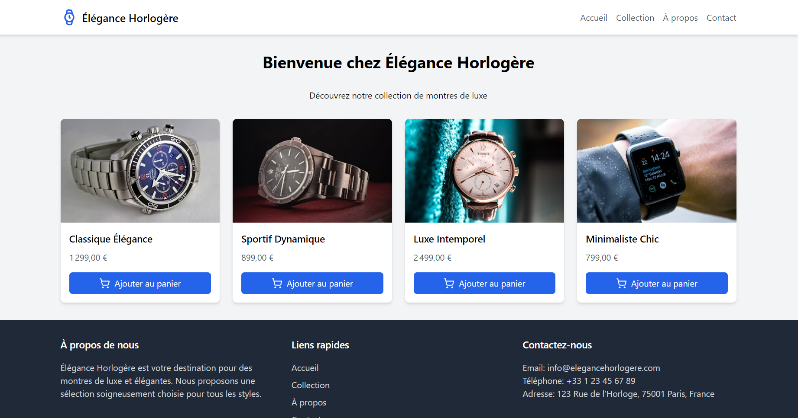

# Élégance Horlogère



[English](#english) | [Français](#français)

Élégance Horlogère est une boutique en ligne de montres de luxe, créée avec React et Tailwind CSS. Ce projet offre une expérience utilisateur élégante et responsive pour la présentation et la vente de montres haut de gamme.

## Fonctionnalités

- Page d'accueil avec présentation des montres vedettes
- Page de collection complète des montres
- Page À propos présentant l'histoire et la mission de la boutique
- Page de contact avec formulaire
- Design responsive s'adaptant à tous les appareils

## Prérequis

- Node.js (version 14 ou supérieure)
- npm (généralement installé avec Node.js)

## Installation

1. Clonez ce dépôt sur votre machine locale :
   ```
   git clone https://github.com/votre-nom-utilisateur/elegance-horlogere.git
   ```

2. Naviguez dans le dossier du projet :
   ```
   cd elegance-horlogere
   ```

3. Installez les dépendances :
   ```
   npm install
   ```

## Lancement du projet

Pour lancer le serveur de développement :
```
npm run dev
```

Le site sera accessible à l'adresse : `http://localhost:5173`

## Structure du projet

```
elegance-horlogere/
├── public/
│   └── index.html
├── src/
│   ├── components/
│   │   ├── Footer.tsx
│   │   ├── Header.tsx
│   │   ├── WatchCard.tsx
│   │   └── WatchList.tsx
│   ├── pages/
│   │   ├── About.tsx
│   │   ├── Collection.tsx
│   │   ├── Contact.tsx
│   │   └── Home.tsx
│   ├── App.tsx
│   ├── index.css
│   └── main.tsx
├── .gitignore
├── index.html
├── package.json
├── postcss.config.js
├── README.md
├── tailwind.config.js
├── tsconfig.json
└── vite.config.ts
```

## Technologies utilisées

- React
- TypeScript
- Tailwind CSS
- Vite
- React Router

## Contribution

Les contributions sont les bienvenues ! N'hésitez pas à ouvrir une issue ou à soumettre une pull request.

## Licence

Ce projet est sous licence MIT. Voir le fichier `LICENSE` pour plus de détails.


## English

Élégance Horlogère is an online luxury watch boutique, created with React and Tailwind CSS. This project offers an elegant and responsive user experience for showcasing and selling high-end watches.

### Features

- Home page featuring highlighted watches
- Complete watch collection page
- About page presenting the store's history and mission
- Contact page with a form
- Responsive design adapting to all devices

### Prerequisites

- Node.js (version 14 or higher)
- npm (usually installed with Node.js)

### Installation

1. Clone this repository to your local machine:
   ```
   git clone https://github.com/your-username/elegance-horlogere.git
   ```

2. Navigate to the project folder:
   ```
   cd elegance-horlogere
   ```

3. Install dependencies:
   ```
   npm install
   ```

### Running the project

To start the development server:

```
npm run dev
```

The site will be accessible at: `http://localhost:5173`

### Project Structure

```
elegance-horlogere/
├── public/
│   └── index.html
├── src/
│   ├── components/
│   │   ├── Footer.tsx
│   │   ├── Header.tsx
│   │   ├── WatchCard.tsx
│   │   └── WatchList.tsx
│   ├── pages/
│   │   ├── About.tsx
│   │   ├── Collection.tsx
│   │   ├── Contact.tsx
│   │   └── Home.tsx
│   ├── App.tsx
│   ├── index.css
│   └── main.tsx
├── .gitignore
├── index.html
├── package.json
├── postcss.config.js
├── README.md
├── tailwind.config.js
├── tsconfig.json
└── vite.config.ts
```

### Technologies Used

- React
- TypeScript
- Tailwind CSS
- Vite
- React Router

### Contributing

Contributions are welcome! Feel free to open an issue or submit a pull request.

### License

This project is under the MIT License. See the `LICENSE` file for more details.

---


